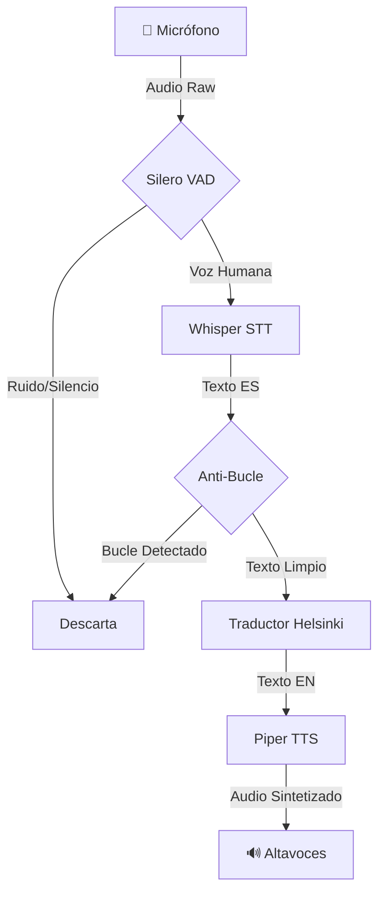

# Estructura del Proyecto y Arquitectura

Este documento describe el flujo lógico y la organización de archivos del sistema **Local Real-Time Translator**.

## 🧠 Diagrama de Flujo Lógico

El sistema procesa el audio en tiempo real siguiendo este pipeline secuencial:

## 📂 Descripción de Archivos Clave

### Raíz del Proyecto
- **`live_translator_vad.py`**: 
  - **Script principal de producción**.
  - **Auto-configuración GPU**: Detecta e inyecta dinámicamente las rutas de librerías NVIDIA (cuDNN/cuBLAS) en el entorno, eliminando la necesidad de configuración manual de `LD_LIBRARY_PATH`.
  - **VAD Integrado**: Utiliza `silero-vad` para filtrar ruido ambiente y solo procesar segmentos con voz humana real.
  - **Lógica Anti-Bucle**: Algoritmo heurístico que detecta y descarta repeticiones infinitas (alucinaciones comunes en Whisper).
  - **Orquestación**: Coordina la captura de audio, transcripción, traducción y síntesis.

- **`check_system.py`**: 
  - Herramienta de **autodiagnóstico y reparación**.
  - Verifica la disponibilidad de GPU (CUDA) y drivers.
  - Comprueba la entrada de audio (micrófono) e intenta reparar la configuración de PulseAudio en Linux automáticamente si falla.

### Módulos (`local_translator/src/`)

- **`src/stt/` (Speech-to-Text)**:
  - Wrapper para **Faster-Whisper** (CTranslate2).
  - Gestiona la carga del modelo en GPU (int8/float16) y la transcripción de audio a texto.

- **`src/translation/`**:
  - Implementa la traducción neuronal usando modelos **Helsinki-NLP** (MarianMT) via `transformers`.
  - Optimizado para traducción rápida ES -> EN.

- **`src/tts/` (Text-to-Speech)**:
  - Controlador para **Piper TTS**.
  - Ejecuta el binario de Piper en un subproceso para generar audio de alta calidad y baja latencia.

- **`src/audio/` y `src/vad/`**:
  - Módulos de utilidad para manipulación de buffers de audio y carga de modelos de detección de actividad de voz.
